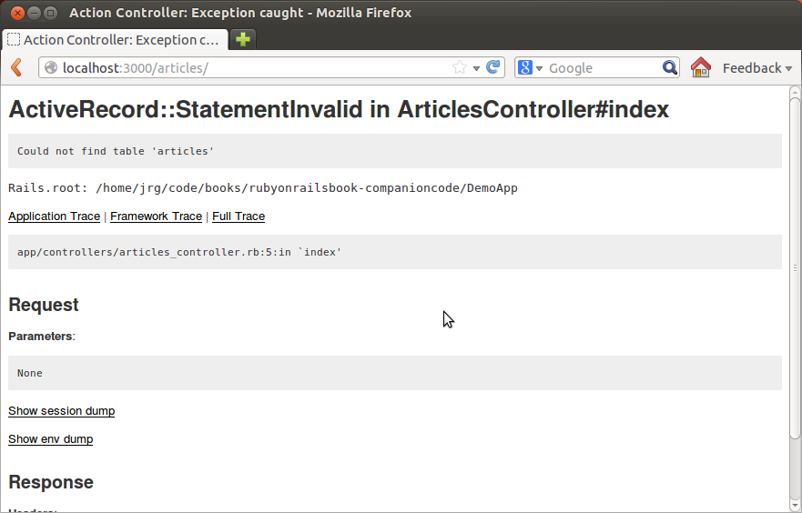
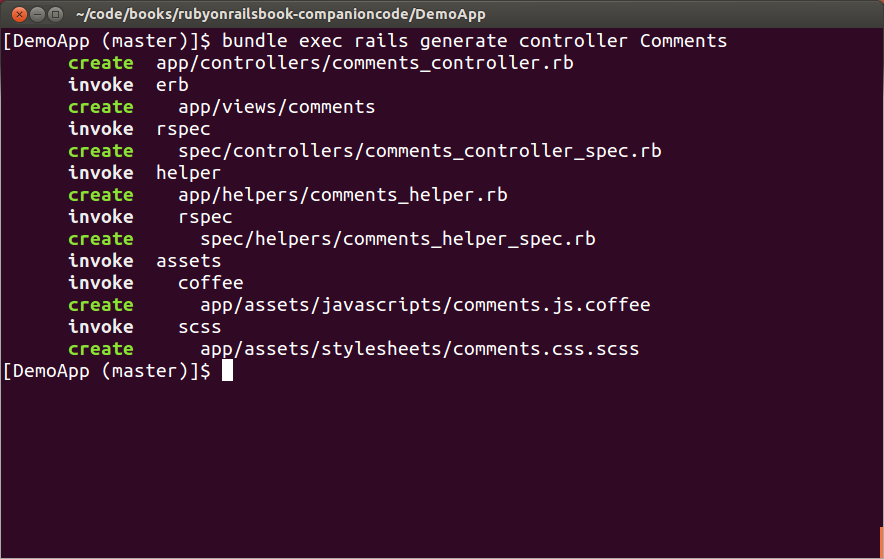
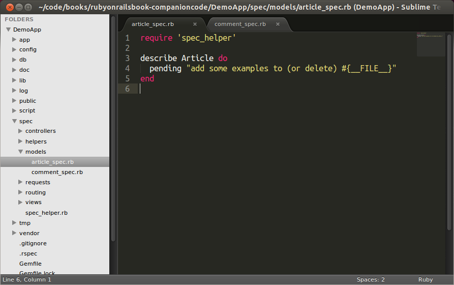
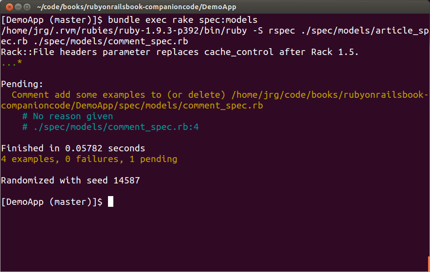

# Chapter One: Lets Start Walking

    $ rails -v
    Rails 3.2.11

Note: At time of writing, Rails 4 is still in beta. It should return at least 4.0.0 by the time you are reading this.

Now create the Demo App: Run 

    rails new DemoApp

Wait for it to finish, and then run

    cd DemoApp

Run `bundle exec rails server` from the application folder.

Now open up your web browser (I'll be using Firefox), and head to

> localhost:3000

You should see something like this:

<!-- we'll stick with pure markdown for now, images be durned!-->

Now lets take a little walk through everything.

Inside the rails application we just created (The DemoApp one), we have the following files - I'm going to briefly explain them.

- app: This contains the controllers, models, views and assets for your application. You'll focus on this folder.
- config: Configure your application's runtime rules, routes, database and more. We will get into this later as well.
- config.ru: Rack configuration for Rack based servers that are used to run the application.
- db/: Contains your current database scheme, as well as the database migrations.
- doc/: In-depth documentation for your application.
- Gemfile and Gemfile.lock: These files let you specify what the gem dependencies are for your application.
- lib/: Extended modules for your application.
- log/: Application log files. Can be useful for debugging things.
- public/: Contains the static files, compiled assets etc.
- Rakefile: This file finds and loads tasks that you can run from the command prompt. The tasks are defined in the components of rails, and in Gems (dependencies defined in the Gemfile).
- README.rdoc: This is a brief manual for your application. You need to edit this file to tell others what it does, how to configure it, any system dependecies, etc.
- script/: Contains the rails script that will start your app and can contain other scripts you write to deploy or run your applicaiton.
- test/: Unit tests, fixtures and other test resources. These will be covered in a future chapter.
- tmp/: Temporary files, ignore this.
- vendor/: A place for all third-party code. In a normal Rails applicaiton, this includes Ruby Gems, the rails source code (if you choose to install it in your actual project) and plugins containing additional prepackaged features.

So that's a brief, 1,000-mile-high overview of a rails application. Now what?

Now, lets get our feet wet.

Open up the `Gemfile`, and add in the following line at the bottom:

    gem 'strong_parameters'

Once you've done that,
Open a new terminal window, and run the following command:

    bundle install
    
And then when that is done, run:

    bundle exec rails generate scaffold article title:string body:text

You'll see something like this:

What this will do is create a database migration, model, controller and views. 

Lets take a look at what we just did. Head over to

> [http://localhost:3000/articles](http://localhost:3000/articles)

And you should get a ` ActiveRecord::StatementInvalid` error. 

<!--[!ActiveRecord::PendingMigrationError](images/005.png)-->

To fix that, simply run

    bundle exec rake db:migrate

and then reload the page.

You should see something like this:

Now, lets create a article. Click the "New Article" button, and fill it out.

It will redirect you to the `article#show` action. 

Now, let's take a look at what is happening behind the scenes here.

Open up the `app/controllers/articles_controller.rb` file in your editor.

The part we are interested in is the `def show` action.

    # GET /articles/1
    # GET /articles/1.json
    def show
      respond_to do |format|
        format.html # show.html.erb
        format.json { render json: @article }
      end
    end

We'll dig into exactly what this does later, but for now, let's just remember that it mentions `@article`. This will be important soon.

Now, let's take a look at the `app/views/articles/show.html.erb` file.

Notice here, it has the following lines:
    
    <%= @article.title %>
    <%= @article.body %>

So, what does this do? Well, as you learned in *Learn Ruby The Hard Way*, when it's @variable, that means we're calling a instance variable, and when it's @variable.something, that means we're calling a method on that instance. In these cases, we are calling the .title and .body methods, which return strings and text, respectively. Where does rails define that it's a string vs a number vs a boolean?

The answer lies in `db/migrate`, and in one other place.

There is a file called `20130104155555_create_articles.rb`.
*please note that it might not be that exact file name, the 20130104155555 at the beginning of mine is a date and time stamp, and so it will change for you as well*

    class CreateArticles < ActiveRecord::Migration
      def change
        create_table :articles do |t|
          t.string :title
          t.text :body

          t.timestamps
        end
      end
    end

Now, a question: Anyone remember where the other place we mentioned it would **describe** itself?

Ah, right. The Model. Lets go take a look at that, shall we?

It's pretty sparse. 

    class Article < ActiveRecord::Base
    end

Just two lines. So, what can we do here?

Well, lets head back to the browser really quick.

> [localhost:3000/articles/new](http://localhost:3000/articles/new)

Just click the "create article" button. Don't enter anything into the form.

Well, would ya look at that! It's empty!

We'll fix this in Chapter 3. 

Ok, so, wrap up what we've covered:

- Models.
- A brief over view of a rails application.
- scaffolding.
- databases - kinda. 
- views. not much, but we know they exist. 
- controllers.

##Extra Credit

- find out what `json` is.
- look around in `app/views/articles/show.html.erb`, and try to figure out what it does. We will discuss it in the next chapter.
- in `app/views/articles/_form.html.erb`, on line 4 we have the error message we saw earlier. what does `@articles.errors.count` do?

# Chapter Two: Lets Take a jog around the block with some comments

Ok, so we've basically been making a blog here, right? Lets quickly write out the 'core' functionality of a blog:

- blog posts/articles. 
- comments.
- users so we know *who* is writing the comments and articles.
- twitter buttons.
- a not-so-ugly lookin' design. 

So we've got the first one sketched out already. Let's go dive into the next one. 

Run this in the terminal:

`bundle exec rails generate model Comment commenter:string body:text article:references`

Lets take a look at `app/models/comments.rb`

It has the following lines in it:

    class Comment < ActiveRecord::Base
      include ActiveModel::ForbiddenAttributesProtection
      belongs_to :article
    end

In addition to the model, rails also generated the file `db/migrate/20130106225333_create_comments.rb`. Let's take a look inside that too:

    class CreateComments < ActiveRecord::Migration
      def change
        create_table :comments do |t|
          t.string :commenter
          t.text :body
          t.references :article, index: true

          t.timestamps
        end
      end
    end

Ok, so let's walk through this line by line.

    class CreateComments < ActiveRecord::Migration

This defines our class "CreateComments", and says it inheirits from ActiveRecord::Migration. Since this is a database migration, this is the right thing.

      def change
        create_table :comments do |t|

Grouping these together for consistency

we define a method called `change`, and then call `create_table` with `:comments`. 

          t.string :commenter

This adds a column in the database called "commenter" that is a string.

          t.text :body

This adds a column in the database called "body" that is a string.

          t.references :article, index: true

This adds in a reference to the articles model we created earlier, and sets :index to true.

          t.timestamps

This is just there for timestamping - so you can do sorting by last created, first created, created within a time period, etc.

Lets run the database migrations:

Open up `app/models/article.rb`, and edit it to look like this:

Now, we're going to tinker with something called 'routes'. This is a way to generate URLs from code. 

Open up `config/routes.rb`, and take a look inside. 

By default, there are a lot of examples that are commented out, so we'll be ignoring them for now.

Change the

    resources :articles

to

    resources :articles do
      resources :comments
    end

So it should look like this:

Next up: building a controller for our comments.

    bundle exec rails generate controller Comments

This command generated a lot of files, so we'll take a quick look at what each of them does.

- app/controllers/comments_controller.rb: This is our controller.
- app/views/comments: This is where we will put our views. 
- test/controllers/comments_controller_test.rb: This is a controller test. We'll dig more into tests in a future chapter.
- app/helpers/comments_helper.rb: This is a "helper", where we can store bits of code we might reuse in our views.
- test/helpers/comments_helper_test.rb: This is where we can test the code in our helper.
- app/assets/javascripts/comments.js.coffee: Our coffeescript file. We'll dig into what coffeescript is later.
- app/assets/stylesheets/comments.css.scss: This is our SCSS file, or stylesheet. It's a different way of writing plain CSS.

Now, let's wire everything into the view.

Open up `app/views/articles/show.html.erb`.

And then in before the `<%= link_to 'Edit', edit_article_path(@article) %>` line, type in this:

    <h2>Add a comment:</h2>
    <%= form_for([@article, @article.comments.build]) do |f| %>
      

        <%= f.label :commenter %> 
        <%= f.text_field :commenter %>
      

      

        <%= f.label :body %> 
        <%= f.text_area :body %>
      

      

        <%= f.submit %>
      

    <% end %>

So what does this do?

Well, it creates a form for @article.comments, and then we proceed to enable then to enter in the comment's details. Lets try this out. 

If you haven't already, go start your server with

> bundle exec rails server

And then head to [localhost:3000/articles](http://localhost:3000/articles/) and pick an article, or if you need to, create one.

Now, go ahead and click "Create Comment".

<!--\-->

Uh-oh. We didn't make a create action in our controller. Lets fix that.

    class CommentsController < ApplicationController
      def create
        @article = Article.find(params[:article_id])
        @comment = @article.comments.create(comment_params)
        redirect_to article_path(@article)
      end

      private
        def comment_params
          params.require(:comment).permit(:commenter, :body)
        end
    end

Now, lets walk through this line by line so we understand what it does.

    class CommentsController < ApplicationController
      def create
        @article = Article.find(params[:article_id])

This creates the CommentsController class that inheirits from ApplicationController.
It then creates the create action, and sets up the @article variable to equal the current article based off of the article_id parameters.

    @comment = @article.comments.create(comment_params)

this creates the `@comment` variable, which equals `@article.comments.create` - which means we're going to create a new comment. The `(comment_params)` part will make some more sense soon. 

        redirect_to article_path(@article)

That means that when it's all done with the stuff above it, it will redirect_to the article_path, with the parameters @article - is the article_id if you remember from above.

      private
        def comment_params
          params.require(:comment).permit(:commenter, :body)
       end

So first we call the `private` keyword, which means that everything that follows is private, and can't be called outside of this controller.

We then define the comment_params that we used earlier. Basically, we are defining what parameters we want to be whitelisted - this is to prevent people from say, editing someone elses posts. 

Now, save the controller, and try to create a comment again. You will notice that it will succeed, but nothing will appear.

Next up: Creating the view for our comments.

Find the the show.html.erb file for our articles view, and open it up.

Now, type this in, after `<%= @article.body %>`, and before `<%= form_for([@article, @article.comments.build]) do |f| %>`.

    <h2>Comments</h2>
    <% @article.comments.each do |comment| %>
      

        <strong>Commenter:</strong>
        <%= comment.commenter %>
      

 
      

        <strong>Comment:</strong>
        <%= comment.body %>
      

    <% end %>

Save the file, and refresh your browser. You should see this:

Now, lets refactor some stuff. Right now, things are getting pretty gnarly in the views, so let's extract some things to a partial.

To do that, make the file `app/views/comments/_comment.html.erb`, with the contents below:

    <% @article.comments.each do |comment| %>
      

        <strong>Commenter:</strong>
        <%= comment.commenter %>
      

 
      

        <strong>Comment:</strong>
        <%= comment.body %>
      

    <% end %>

And then change the `app/views/articles/show.html.erb` file to look like this:

    
<%= notice %>

    

      <strong>Title:</strong>
      <%= @article.title %>
     

    

      <strong>Body:</strong>
      <%= @article.body %>
    

    <h2>Comments</h2>

    <%= render @article.comments %>

    <%= form_for([@article, @article.comments.build]) do |f| %>
    ....

    <% end %>
    <%= link_to 'Edit', edit_article_path(@article) %> |
    <%= link_to 'Back', articles_path %>

This will render the partial in `app/views/comments/_comment.html.erb` once for each comment in the array (collection) that `@article.comments` returns.

Lets extract the new comment form into it's own partial as well.

Create a file called `app/views/comments/_form.html.erb`, and put the following into it:

    <%= form_for([@article, @article.comments.build]) do |f| %>
      

        <%= f.label :commenter %> 
        <%= f.text_field :commenter %>
      

      

        <%= f.label :body %> 
        <%= f.text_area :body %>
      

      

        <%= f.submit %>
      

    <% end %>

Save the file, and then edit `app/views/articles.show.html.erb` to look like this:

    
<%= notice %>

    

      <strong>Title:</strong>
      <%= @article.title %>
    

    

      <strong>Body:</strong>
      <%= @article.body %>
    

    <h2>Comments</h2>

    <%= render @article.comments %>

    <h2>Add new comment</h2>
    <%= render "comments/form" %>

    <%= link_to 'Edit', edit_article_path(@article) %> |
    <%= link_to 'Back', articles_path %>

    
Save the file, and refresh. 

Now, lets make it so we can delete comments.

To add the delete link, edit `app/views/comments/_comment.html.erb` to include a link:

      

        <%= link_to 'Destroy Comment', [comment.article, comment],
                    method: :delete,
                    data: { confirm: 'Are you sure?' } %>
      

      

So right now, if we were to try that, we'd see something like this:

We need to define the `destroy` action in `app/controllers/comments_controller.rb`.

Add the following after `create`, and before the `private`.
      

      def destroy
        @article = Article.find(params[:article_id])
        @comment = @article.comments.find(params[:id])
        @comment.destroy
        redirect_to article_path(@article)
      end
      

So the file looks like this:

Now, you can delete articles. Go right ahead and add and delete some.
I'll be here when you get back.

Right now, if we delete an article, we don't delete the comments associated with it
- they stick around in the database.

We can fix that by changing a single line in `app/models/article.rb`:

    has_many :comments, :dependent => :destroy

Now, when you delete a article, it will delete the comments. Lets try this out.

Create an article with two or three comments.

Now, lets open up the rails console.

    rails console
    
Type in `comments = Comment.last` at the prompt, and you should see something like this:

    1.9.3p374 :001 > comments = Comment.last
    
      Comment Load (0.2ms)  SELECT "comments".* FROM "comments" ORDER BY "comments"."id" DESC LIMIT 1
    => #<Comment id: 8, commenter: "foobar1", body: "asdlkjfaskljf", article_id: 3, created_at: "2013-01-29 22:13:34", updated_at: "2013-01-29 22:13:34"> 
   
    1.9.3p374 :002 > 

    
Ok, now delete the article.

Now re-run `comments = Comment.last` in the rails console.

    1.9.3p374 :001 > comments = Comment.last
      Comment Load (0.2ms)  SELECT "comments".* FROM "comments" ORDER BY "comments"."id" DESC LIMIT 1
     => nil 
    1.9.3p374 :002 > 

There you go. When the parent article is deleted, so are the comments.

#Chapter Three: How The West Was Tested

Lets talk about tests. Specifically, why we should write them.

Remember how in chapter one we briefly talked about the test directory, and the contents?

Lets take a look inside 

Not a lot there. Now, lets make this useful.

Add the following below the `test "the truth" do...end` section.

      test "without a body or title is is not valid" do
        article = Article.new
        
        assert !article.save
      end
  
      
Now, lets run our test.
    
    rake test:units

We should see something like this:

Uh-oh, we've got a failed test. 

so, what can we do about this? Well, we can add in some validations. Head back to your model, and type this in after the `class Article < ActiveRecord::Base` part, and before the end:

      validates :body, :presence => true
      validates :title, :presence => true,
                    :length => { :minimum => 5 }

Save the file.

Before we go back to the browser, what do you think it does? Think about this for a minute or so - if in a group setting, discuss it with your pairing partner. 

Ok, you're back? Good. 

Now, head back to the `articles/new` route, and try to make an empty article. You should see something like this:

Ah re-run the test.

    rake test:units
    

Let's take a quick side trip into why we should do test driven development.

> Test-driven development (TDD) is a software development process that relies on the
> repetition of a very short development cycle: first the developer writes an (initially failing)
> automated test case that defines a desired improvement or new function, then produces the minimum
> amount of code to pass that test, and finally refactors the new code to acceptable standards.
> Kent Beck, who is credited with having developed or 'rediscovered' the technique, stated in 2003 
> that TDD encourages simple designs and inspires confidence.

[Thank you Wikipedia](http://en.wikipedia.org/wiki/Test-driven_development)

So, lets sum this up, and why this is relevant for us right now.

Tests are important, because it helps us break the problems down into the smallest bits possible.

In the future, if we need to upgrade something, or re-write something, we have a safety net of your tests.

  test "that with a body and title it is valid" do
    article = Article.new(:title => "This is a title", :body => "This is a body")
    assert article.save
  end

  test "that without a body and with a title it is valid" do
    article = Article.new(:title => "This is a title", :body => "")
    assert !article.save
  end

  test "that without a title and with a body it is valid" do
    article = Article.new(:title => "", :body => "This is a body")
    assert !article.save
  end
end